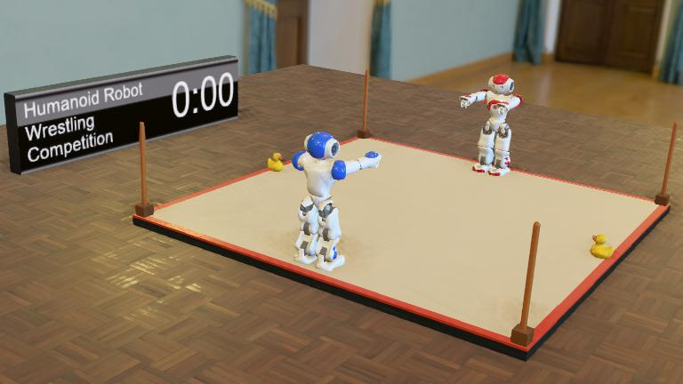

<span id="title">

# IROS 2023 Wrestling Competition

</span>

[][1]

<span id="description">

This competition focuses on the development of advanced humanoid robot control software for a wrestling game. It relies on a calibrated simulation model of the NAO robot, running in the Webots simulator with realistic physics, sensor and actuator simulation.

</span>

Being spectacular and easy to get started with, this competition aims at gathering a large number of competitors, both on-site and remotely. The fully open-source competition software stack was designed to be re-used as a [template](https://github.com/cyberbotics/competition-template) for other simulation-based robot competitions.



## Competition Information

<span id="information">

- Difficulty: Master or PhD
- Robot: [NAO](https://webots.cloud/run?version=R2023b&url=https://github.com/cyberbotics/webots/blob/develop/projects/robots/softbank/nao/protos/Nao.proto)
- Programming Language: any
- Commitment: a few weeks
- Prize: [1 Ether](https://www.google.com/search?q=ethereum+price)

</span>

## Important Dates

| date                                                                                                             | description                                      |
|------------------------------------------------------------------------------------------------------------------|--------------------------------------------------|
| June 23rd, 2023                                                                                                  | registration opens and qualification games start |
| September 19th, 2023                                                                                             | selection of the best 32 teams                   |
| September 26th, 2023                                                                                             | code freeze for the finals                       |
| **October 2nd, 2023** - [4pm EDT](https://dateful.com/convert/eastern-daylight-time-edt?t=4pm&d=2023-10-02)      | **1/16 finals**                                  |
| **October 3rd, 2023** - [11am EDT](https://dateful.com/convert/eastern-daylight-time-edt?t=11am&d=2023-10-03)    | **1/8 finals**                                   |
| **October 3rd, 2023** - [4:30pm EDT](https://dateful.com/convert/eastern-daylight-time-edt?t=430pm&d=2023-10-03) | **1/4 finals**                                   |
| **October 4th, 2023** - [11am EDT](https://dateful.com/convert/eastern-daylight-time-edt?t=11am&d=2023-10-04)    | **semifinals, third place game and final**       |

### Finals

The finals will take place during the [IROS 2023](https://ieee-iros.org) conference in Detroit (USA) and will be broadcasted online in real time.
Remote participation will be possible.

### Selection for the Finals

On September 19th, at [9am EDT](https://dateful.com/convert/eastern-daylight-time-edt?t=9am&d=2023-09-19), we will select the best 32 teams from the [leader board][1] that will participate to the finals.
These teams will have exactly one week of time to further improve their robot controller before their code is frozen and checked out for the finals.
Meanwhile, other teams will not be allowed to run games any more.

On September 26th, between [9am EDT](https://dateful.com/convert/eastern-daylight-time-edt?t=9am&d=2023-09-26) and [11am EDT](https://dateful.com/convert/eastern-daylight-time-edt?t=11am&d=2023-09-26), we will checkout the current version of the robot controller for each qualified participant.
Please refrain from making any commit to your main branch during this period as it may have unexpected consequences on your controller.
We will use exclusively this version for running all the final games from the 1/16 finals until the final.

### Finals Games

All the finals games will be played in sets, in a best-of-five format, which means that players need to win 3 sets to win the game (like in Grand Slams ATP tennis tournaments). Therefore a finals game will have between three and five sets and the final score will be either 3-0, 3-1 or 3-2.

Here is the [result](result.md) page that will reflect in real-time the finals games, so that online competitors can follow the finals remotely.
The **Game** columns will contain links to 3D playbacks of the sets.

### Certificates

The 32 best ranked participants will receive an official certificate mentionning the robot controller name, team members and organization, as described respectively in the name, team and organization fields of their [participant.json](controllers/participant/participant.json) file.

## Prize

The winning team will receive [one Ether](https://www.google.com/search?q=ethereum+price) crypto-currency (priced around USD 1'742 on June 14th, 2023) and an official IROS certificate.
The second and third place will receive an official IROS certificate.

## Participation Conditions

Participation is free of charge, including the finals.
Anyone can participate: there is absolutely no restriction on the quality and number of team members.
A team may perfectly have only one single member.
However, an individual cannot be a member of several teams in the [leaderboard][1].
Also, sharing code privately with another team is not allowed.
But, sharing code publicly is allowed as long as it is immediately announced on [this GitHub Discussions](https://github.com/cyberbotics/wrestling/discussions/).
Any team suspected to break any of these rules will be removed.

## Get Started Now

To get started programming your wrestling robot, you will have to:

### 1. Create your own Participant Repository from this Template

[Click here](../../generate) to create your own repository automatically or do it manually by clicking on the green button "Use this template".
If you get a 404 page it's probably because you are not connected to your GitHub account.
- Fill the "Repository name" field with a name for your controller.
- Set the visibility of your repository to "Private" unless you don't care about people looking at your code.
- Finally, click on the green button "Create repository from template".

You should continue reading this document on your **own** repository page and not this one.
**This is important** in order to be able to use the links in the following sections.
Remember that you can open a link in a new tab by middle-clicking the link.

### 2. Add [omichel](https://github.com/omichel) as a Collaborator

You can skip this step if you created your repository as "Public" instead of "Private".

Otherwise, you must grant access to your repository to the competition organizer so that your code can be checked out to evaluate its performance and the organizer can post issues on your repository in case of problems with your code.

- [Click here](../../settings/access) to go to the "Collaborators" setting page. You might need to confirm the access by re-entering your GitHub password.
- You should see a "Manage access" box where you will see the current collaborators of the repo.
Click on the "Add people" and search for "[omichel](https://github.com/omichel)".
When you found the organizer, add him to the repository.

### 3. Modify your Robot Controller

You can now edit your [participant.json](../../edit/main/controllers/participant/participant.json) file to set your name, description and country information and also modify your [main robot controller file](../../edit/main/controllers/participant/participant.py) or create new files in this folder and push the modification to the main branch of your repository.
A series of automated actions will take place in a few seconds.
If everything went well, your repository should appear after some time in the [leader board][1] of the competition.
If there was a problem, an [issue](../../issues) will be open automatically on your repository by the organizer.
You will have to read it, fix what is wrong and push the changes to your main branch to re-run the automated verification.

## Rules

*Note*: the rules might be slightly adapted to fix minor issues until September 1st, 2023. Past this date, no change will be made to rules.

The rules of game are implemented in the [referee supervisor](controllers/referee/referee.py).
They can be summarized as follow:

A game lasts until one of these two conditions occurs:
- **Knock-out**: If the altitude (along Z axis) of the head of a robot remains below a given threshold and below the one of the other robot for more than 10 seconds, then the other robot is declared the winner and the game is immediately over. This may happen if a robot falls down and cannot recover quickly or if it falls off the ring.
- **Time-out**: If no knock-out happened after 3 minutes, the robot having the greater ring *coverage* is declared the winner and the game is over. In the unlikely case of *coverage* equality, the winner is determined randomly. 

The *coverage* reflects how far a robot has moved inside the ring. It is computed over the time frame of a game from its maximum and minimum positions along the X and Y axes, respectively *X_max*, *X_min*, *Y_max* and *Y_min*, using the following formula:

```python
coverage = X_max + Y_max - X_min - Y_min
```

### Demo Robot Controllers

A series of simple examples are provided using different programming languages or frameworks and different complexity levels:

| Language / Framework | Examples |
|---|---|
| Python | [Alice](https://github.com/cyberbotics/wrestling-alice "Alice plays a simple motion file."), [Bob](https://github.com/cyberbotics/wrestling-bob "Bob sends position commands to some motors and plays a motion file."), [Charlie](https://github.com/cyberbotics/wrestling-charlie "Charlie plays a custom motion file and uses the LEDs."), [David](https://github.com/cyberbotics/wrestling-david "David is able to detect when he falls down and to recover."), [Eve](https://github.com/cyberbotics/wrestling-eve "Eve processes camera images to detect her opponent and targets him."), and [Fatima](https://github.com/cyberbotics/wrestling-fatima "Fatima uses an advanced gait manager with inverse kinematics.") |
| C      | [Alice](https://github.com/cyberbotics/wrestling-alice-c "Alice plays a simple motion file.")    |
| C++    | [Alice](https://github.com/cyberbotics/wrestling-alice-cpp "Alice plays a simple motion file.")  |
| Java   | [Alice](https://github.com/cyberbotics/wrestling-alice-java "Alice plays a simple motion file.") |
| ROS 2  | [Alice](https://github.com/cyberbotics/wrestling-alice-ros-2 "Alice plays a simple motion file."), [Bob](https://github.com/cyberbotics/wrestling-bob-ros-2 "Bob sends position commands to some motors and plays a motion file.")  |
| Rust   | [Ferris](https://github.com/katharostech/icra-2023-robot-wrestling-rust-template "Ferris sends position commands to some motor.") |

### Recommendation to Competitors

The earlier you start working on the competition, the better.
The ranking algorithm allows a very good robot controller to climp-up to the top of the [leader board][1] in one day.
However, in practice, it is recommended to enter the [leader board][1] rankings as early as possible.
This allows you to compare your robot controller to others and have time to improve its performance.

### Include Dependencies in your Docker Container

Your controller is run in a [Docker container](https://www.docker.com/resources/what-container/). If your robot controller has dependencies, such as some specific libraries, python modules, a Java programming interface or a complete ROS framework, be sure to update the [controllers/Dockerfile](controllers/Dockerfile) to include all these dependencies. The default Dockerfile includes the tools needed to run and compile simple C, C++ and Python controllers.

### Ranking System

Each time you push a commit on your main branch, a series of games is started on the runner machine.
If you are ranked number 1, no game will take place.
Otherwise, you will first play a game against the competitor ranked just above you in the [leader board][1].
If you loose, nothing will be changed in the [leader board][1] ranking and no further game will be played.
Otherwise, you will swap your position in the [leader board][1] with the competitor just above you and you will play another game with the competitor just above your new position.
This will be repeated as long as you win until you reach the first rank of the [leader board][1].

### Checking the Log File of an Evaluation Run

When there is a problem with your repository, an issue is opened automatically on your repository to invite you to check the log of the evaluation run.
However, if your controller crashes for some reason, no error will be reported to you, but the animation of your robot will show your robot not moving at all (and your robot will likely loose the game).
It that case, you should check the log file of the evaluation run to understand why your controller crashed.
All the log files are available on https://github.com/cyberbotics/wrestling/actions

### Friendly Test Games

It is possible for the participants to start a friendly test game against another participant of their choice.
This can be achieved from the [Actions](../../actions) tab of the participant repository: select the [Trigger Test Game](../../actions/workflows/test.yml) action and click the <kbd>Run workflow</kbd> button.
Enter the name of your opponent as it appears in the [leader board][1] and click the green <kbd>Run workflow</kbd> button.
Once complete, friendly test games can be viewed from the `Test` buttons in the [leader board][1].

### Runner Machine Configuration

The runner machine will host a single game at a time.
It will run 3 docker containers:

1. One with Webots and the wrestling supervisor.
2. One with the controller of the red player (participant).
3. One with the controller of the blue player (opponent).

Each docker container running a robot controller has [3](https://github.com/cyberbotics/wrestling/blob/0d017092f85cb989dcc0c65eb0e5a2ac18042ade/webots.yml#L9) virtual [CPU cores](https://github.com/cyberbotics/competition-record-action/blob/e820b586cf3ad70257682afb5245df9d2a5fc7c8/metascript/animation.py#L146-L147), [6 GB](https://github.com/cyberbotics/wrestling/blob/0d017092f85cb989dcc0c65eb0e5a2ac18042ade/webots.yml#L10) of [RAM](https://github.com/cyberbotics/competition-record-action/blob/e820b586cf3ad70257682afb5245df9d2a5fc7c8/metascript/animation.py#L239-L240) and shared access to the GPU hardware. However, we request that participants do not exceed 1 GB of GPU RAM usage for their robot controller. Participant exceeding this limit will be disqualified without prior notice.

The runner machine configuration is the following:
- CPU: [Intel core i7-6700K @ 4.00 Ghz](https://www.cpubenchmark.net/cpu.php?id=2565).
- RAM: 16 GB.
- GPU: [NVIDIA GeForce GTX 1060 3 GB](https://www.videocardbenchmark.net/gpu.php?id=3566).

[1]: https://webots.cloud/run?version=R2023b&url=https%3A%2F%2Fgithub.com%2Fcyberbotics%2Fwrestling%2Fblob%2Fmain%2Fworlds%2Fwrestling.wbt&type=competition "Leader board"
